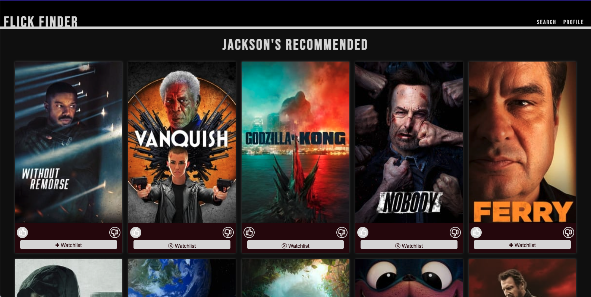

<h1 align="center">Flick Finder</h1>
<a align="center" href="https://flickfinder2011.herokuapp.com/#/home">- Deployed App -</a>

## Table of Contents

- [About the Project](#about-the-project)
- [Project Goals](#project-learning-goals)
- [Challenges and Wins](#Challenges)
- [Installation](#installation)
- [Technologies Used](#technologies-used)
- [Contributors](#contributors)

## About the Project

In this capstone project, our team was asked to create a full-stack app of our choosing and push ourselves by implementing a new technology. The back-end team chose to learn Python, while our front-end team decided to use the framework Vue. By the end of the project, both teams successfully understood and applied both technologies to the project 


#### Final Product:

##### Login Page: 


##### Home Page:


##### Search Page: 


##### Profile Page: 


#### Details Modal: 


#### Mobile:


#### Tablet: 


## Project Learning Goals
1. Demonstrate knowledge you’ve gained throughout Turing
2. Use an agile process to turn well defined requirements into deployed and production ready software
3. Gain experience dividing applications into components and domains of responsibilities to facilitate multi-developer teams. Service oriented architecture concepts and patterns are highly encouraged.
4. Explore and implement new concepts, patterns, or libraries that have not been explicitly taught while at Turing
5. Practice an advanced, professional git workflow using Git Rebase
6. Gain experience using continuous integration tools to build and automate the deployment of features
7. Build applications that execute in development, test, CI, and production environments
8. Focus on communication between front-end and back-end teams in order to complete and deploy features that have been outlined by the project spec

## Challenges
1. Building an app with Vue(new to frontend team).
2. Learning and following a Git Rebase workflow.
3. Working hand in hand with a backend team to meet sprint deadlines for the first time.
4. Evolving project MVP, and intial documentation. The look and essential functionality of the app were everchanging throughout the project.
5. Realizing that we had neglected to fully understand the structure and common practices of Vue apps up front, and consequently changing our app's structure from the ground up.
## Wins
1. Built a sharp and professional app with the help of our backend team.
2. Despite the major Vue restructuring and countless documentation changes, we were able to push through and create an app that we are all proud of

## Installation
1. Fork (optional) and clone down this repository to a directory of your choice
2. <code>cd</code> into the repo
3. Run <code>npm i</code> to install dependencies
4. Run the command <code>npm run start</code> to run the application in your browser
5. Begin interacting [here](http://localhost:8080)

## Testing
1. After completing the Installation steps above and starting the server in your local browser:
2. Run ```$npx cypress open``` from your terminal to open up the cypress client.
3. Click on the ```test.js``` to open up the live testing browser.

## Technologies Used
- 

- [](https://www.javascript.com/)

- 

- 

- 

- 
#### Accessibility
1. Passes Wave audit with no errors.
2. Uses Semantic HTML.
3. Site is fully tabbable and accessible through screen readers.
4. Passes Lighthouse Accessibility Audit with 100%
## Contributors 

#### Front-End: 
[][linkedin0]
[][github0]

[][linkedin1]
[][github1]

[][linkedin2]
[][github2]

#### Back-End:
- [Garrett Cottrell](https://github.com/GarrettCottrell)
- [Hope Gochnour](https://github.com/hopesgit)
- [Travis Robinson](https://github.com/Trevor-Robinson)

<!-- Personal Definitions  -->
[linkedin0]: https://www.linkedin.com/in/matt-umland-he-him-4264455b/
[github0]: https://github.com/mattumland
[linkedin1]: https://www.linkedin.com/in/jackson-mcguire/
[github1]: https://github.com/Jacksonmcguire
[linkedin2]: https://www.linkedin.com/in/julia-iwinski-898540138/
[github2]: https://github.com/jgiwinski

